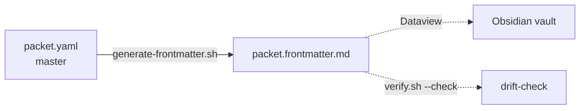

# dataview — Obsidian Dataview plugin integration for math-coding

## Thesis

math-coding's 41+ packets encode structured metadata in
`packet.yaml` (task_id, title, lifecycle, substrate, rigor,
decision, depends_on). The convention already builds on
this — `core/verify.sh`, `core/drift-check.sh`, and
`core/coverage.yaml` query the YAML fields directly.

But Obsidian's Dataview plugin only reads `.md` files,
not `.yaml`. To make Obsidian queries first-class, the
convention exposes the same fields in `packet.frontmatter.md`
— a YAML frontmatter block at the top of a `.md` file
inside each packet directory.

## Antithesis

Three alternatives we considered (and rejected):

- **Hand-write frontmatter in every `.md` file.** Each
  packet would have 4 manual edits × 6 fields × 41 packets
  = ~984 lines of redundant, drift-prone content.
- **Merge 5 files into 1.** Breaks the 5-file convention;
  Dataview works on the single file; but every packet in
  the repo would need to be restructured.
- **Run only at probe time, ephemerally.** Dataview in
  Obsidian sees what's on disk, not what's generated
  transiently. Ephemeral frontmatter defeats the use case.

## Synthesis

One file per packet, auto-generated from `packet.yaml`,
lint-enforced.

The `core/generate-frontmatter.sh` script reads each
`math/<name>/packet.yaml` and emits a sibling
`packet.frontmatter.md`. The verifier runs the script in
`--check` mode and fails the convention on drift. The
filler runs it after creating a new packet. Manual work: 0.



## What this packet commits to

- One `packet.frontmatter.md` per packet, auto-generated
- Drift detection through `core/verify.sh`
- `core/generate-frontmatter.sh --check` for ad-hoc lint
- A small library of Dataview queries (see below) in
  this packet's `refinement.md`

## What this packet does NOT commit to

- Frontmatter in every `.md` file (only the new
  `packet.frontmatter.md` per packet)
- A migration of existing packets' `.md` files to embed
  frontmatter (Dataview queries act on `packet.frontmatter.md`)
- Round-trip from frontmatter back to `packet.yaml`
  (frontmatter is read-only, generated artifact)
- Real-time frontend rendering (Dataview queries run in
  Obsidian, not at git-time)

## Packet files

- [decision.md](https://github.com/11111000000/math-coding/blob/main/math/dataview-as-packet/decision.md)
- [task.md](https://github.com/11111000000/math-coding/blob/main/math/dataview-as-packet/task.md)
- [assumptions.yaml](https://github.com/11111000000/math-coding/blob/main/math/dataview-as-packet/assumptions.yaml)
- [refinement.md](https://github.com/11111000000/math-coding/blob/main/math/dataview-as-packet/refinement.md)
- [packet.yaml](https://github.com/11111000000/math-coding/blob/main/math/dataview-as-packet/packet.yaml)

## Decision

## Thesis
math-coding's 41+ packets encode structured metadata in
`packet.yaml` (task_id, title, lifecycle, substrate, rigor,
decision, depends_on). The convention already builds on
this — `core/verify.sh`, `core/drift-check.sh`, and
`core/coverage.yaml` query the YAML fields directly.
But Obsidian's Dataview plugin only reads `.md` files,
not `.yaml`. To make Obsidian queries first-class, the
convention exposes the same fields in `packet.frontmatter.md`
— a YAML frontmatter block at the top of a `.md` file
inside each packet directory.
## Antithesis
Three alternatives we considered (and rejected):
- **Hand-write frontmatter in every `.md` file.** Each
  packet would have 4 manual edits × 6 fields × 41 packets
  = ~984 lines of redundant, drift-prone content.
- **Merge 5 files into 1.** Breaks the 5-file convention;
  Dataview works on the single file; but every packet in
  the repo would need to be restructured.
- **Run only at probe time, ephemerally.** Dataview in
  Obsidian sees what's on disk, not what's generated
  transiently. Ephemeral frontmatter defeats the use case.
## Synthesis
One file per packet, auto-generated from `packet.yaml`,
lint-enforced.
The `core/generate-frontmatter.sh` script reads each
`math/<name>/packet.yaml` and emits a sibling
`packet.frontmatter.md`. The verifier runs the script in
`--check` mode and fails the convention on drift. The
filler runs it after creating a new packet. Manual work: 0.

## What this packet commits to
- One `packet.frontmatter.md` per packet, auto-generated
- Drift detection through `core/verify.sh`
- `core/generate-frontmatter.sh --check` for ad-hoc lint
- A small library of Dataview queries (see below) in
  this packet's `refinement.md`
## What this packet does NOT commit to
- Frontmatter in every `.md` file (only the new
  `packet.frontmatter.md` per packet)
- A migration of existing packets' `.md` files to embed
  frontmatter (Dataview queries act on `packet.frontmatter.md`)
- Round-trip from frontmatter back to `packet.yaml`
  (frontmatter is read-only, generated artifact)

## Task

# dataview — task

## Problem

Obsidian's Dataview plugin exposes `packet.yaml` fields
to SQL-like queries only via `.md` frontmatter. Direct
editing of frontmatter is fragile; we need auto-generation
plus drift detection.

## Desired outcome

- `core/generate-frontmatter.sh` produces one
  `packet.frontmatter.md` per `math/<name>/`
- Drift is detected by `core/verify.sh` (calls
  `--check` mode)
- New packets (via `core/packet-filler.sh`) automatically
  generate frontmatter as part of creation
- An Obsidian vault of the repo has its Dataview queries
  populated by the auto-generated frontmatter

## Constraints

- POSIX shell only
- `packet.frontmatter.md` content is regenerated on every
  invocation of the script — manual edits are lost
- Dataview queries live in this packet's `refinement.md`
- No other files change

## Assumptions

```yaml
task_id: dataview
assumptions:
  - id: A1
    statement: "Dataview reads .md frontmatter only, not .yaml — frontmatter bridge is necessary"
    status: agent-inferred
    epistemology: fact
    confidence: 1.0
    evidence: |
      Dataview plugin documentation: frontmatter must be in
      the markdown file itself, between --- delimiters.

  - id: A2
    statement: "Auto-generating frontmatter from packet.yaml avoids manual duplication"
    status: judgment
    epistemology: judgment
    confidence: 1.0
    evidence: |
      packet.yaml remains master; packet.frontmatter.md
      is derived. One source of truth, one projection.
      See: core/packet-schema.md

  - id: A3
    statement: "Drift-detection in verifier is strict (fail-fast)"
    status: judgment
    epistemology: judgment
    confidence: 0.95
    evidence: |
      Convention's verifier is fail-fast (D02). Drift in
      frontmatter fails verify, forcing regeneration.
      See: core/verify.sh

  - id: A4
    statement: "Dataview queries are user-facing, not convention-mandated"
    status: judgment
    epistemology: judgment
    confidence: 0.95
    evidence: |
      Each user writes their own queries. Convention
      provides examples in refinement.md as starting points
      but doesn't ship query files.
      See: math/dataview-as-packet/refinement.md

  - id: A5
    statement: "Adding 41 files (packet.frontmatter.md × 41) is acceptable cost"
    status: judgment
    epistemology: judgment
    confidence: 0.85
    evidence: |
      Each file is ~10-15 lines. Total ~500-600 lines
      additive. Convention tolerates additive projections
      (decision.md, task.md, etc. — same pattern).
      See: core/packet-schema.md

  - id: A6
    statement: "Frontmatter frontmatter file name 'packet.frontmatter.md' is unambiguous"
    status: judgment
    epistemology: judgment
    confidence: 0.9
    evidence: |
      Naming: <packet-context>.frontmatter.md keeps the
      file paired with the packet, signals its purpose,
      stays inside the 5-file pattern as 6th companion.
      See: dataview-as-packet/decision.md

  - id: A7
    statement: "Dataview query examples documented in this packet's refinement.md are kept minimal (5 queries)"
    status: agent-inferred
    epistemology: fact
    confidence: 1.0
    evidence: |
      Library is for learning. Power users write their own.
      See: refinement.md
```

## Refinement

# Refinement: dataview

## State

- **pre**: Obsidian's Dataview sees `packet.frontmatter.md`
  as plain markdown; 41 packets × 0 queryable fields.
- **post**: Dataview queries the 6 fields (task_id, title,
  lifecycle, substrate, rigor, decision) plus depends_on
  list. Convention exposes drift-check in verifier.

## Operation

- Created `core/generate-frontmatter.sh` (POSIX shell)
- Extended `core/verify.sh` with drift-check 5
- Extended `core/packet-filler.sh` to auto-generate
  frontmatter after creating new packets
- Created `math/dataview-as-packet/` (this packet — 5 files)
- Ran script once: 41 `packet.frontmatter.md` files now
  exist alongside `packet.yaml` in every packet directory

## Mapping (artifact → convention axis)

| Artifact | Axis |
|----------|------|
| `core/generate-frontmatter.sh` | D48 (this packet) |
| `core/verify.sh` extension | Phase E drift-check 5 |
| `core/packet-filler.sh` extension | D10 follow-on |
| `math/dataview-as-packet/` | D48 owner packet |
| 41 `packet.frontmatter.md` files | Obsidian Dataview layer |

## Invariant preservation

- 41 existing packets still pass `core/verify.sh` after
  the extension
- `AGENTS.md` ≤ 60 lines (not touched)
- No new external dependencies

## Test obligation

- `sh core/generate-frontmatter.sh --check` exits 0
- `sh core/verify.sh` exits 0 with 1138+ checks
- Drift introduced via `sed -i 's/lifecycle: working/lifecycle: archived/'`
  produces a single FAIL on `Dataview frontmatter drift`

## Runtime check

- After every commit, agents run `sh core/generate-frontmatter.sh`
  if they edit `packet.yaml`
- `core/probe.sh` could be extended to run it (deferred)

## Dataview query library

Five starter queries for Obsidian Dataview. To use:
open an Obsidian note in the vault, paste a query into a
`dataview` code block, save, and Obsidian renders the
result.

### Q1: All packets by lifecycle

```dataview
TABLE task_id, title, substrate, rigor
FROM "math"
WHERE lifecycle = "working"
SORT substrate ASC
```

### Q2: Strict-rigor packets (proof, temporal)

```dataview
LIST title
FROM "math"
WHERE rigor = "proof" OR rigor = "temporal" OR rigor = "property"
```

### Q3: Theory packets, grouped by theory

```dataview
TABLE task_id AS "packet", title, depends_on
FROM "math"
WHERE startswith(task_id, "theory-")
SORT task_id ASC
```

### Q4: Substrate distribution

```dataview
TABLE substrate, length(rows) AS count
FROM "math"
GROUP BY substrate
SORT substrate ASC
```

### Q5: Packets waiting on lifecycle promotion

```dataview
LIST title
FROM "math"
WHERE lifecycle = "sketch" AND decision = "made"
```

## Cross-reference

- `core/generate-frontmatter.sh` — generation tool
- `core/verify.sh` — drift enforcement
- `core/packet-filler.sh` — auto-integration on create
- `core/obsidian.md` — Obsidian manifest (mentions Dataview
  plugin as recommended)
- `math/obsidian-visualization-as-packet/` — Phase E+ parent

