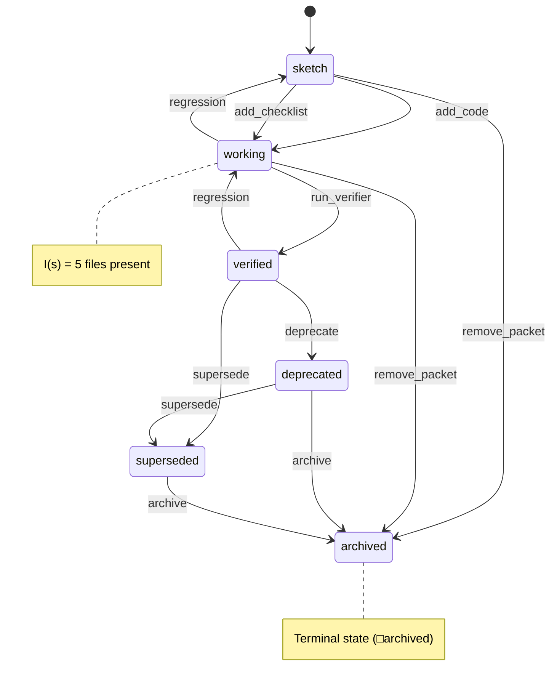

# Theory: Finite State Machine

**Rigor:** any

A finite state machine is a tuple M = ⟨S, s₀, A, →, I⟩ where:

- S is a finite set of states
- s₀ ∈ S is the initial state
- A is a set of actions
- → ⊆ S × A × S is the transition relation
- I: S → B is the invariant

## math-coding instance

In math-coding:

- S = {sketch, working, verified, deprecated, archived, superseded}
- s₀ = sketch
- A = the actions listed in
  [[math/theory-fsm-as-packet/refinement.md#operations|the FSM transitions table]]
- →, forbidden transitions, and invariant I(s) are the
  authoritative tables in
  [[math/theory-fsm-as-packet/refinement.md|the FSM refinement]]

This file is the abstract schema; the packet is the
authoritative instance. Drift between them is detected by
`core/verify.sh`.

## Diagram (Mermaid)

