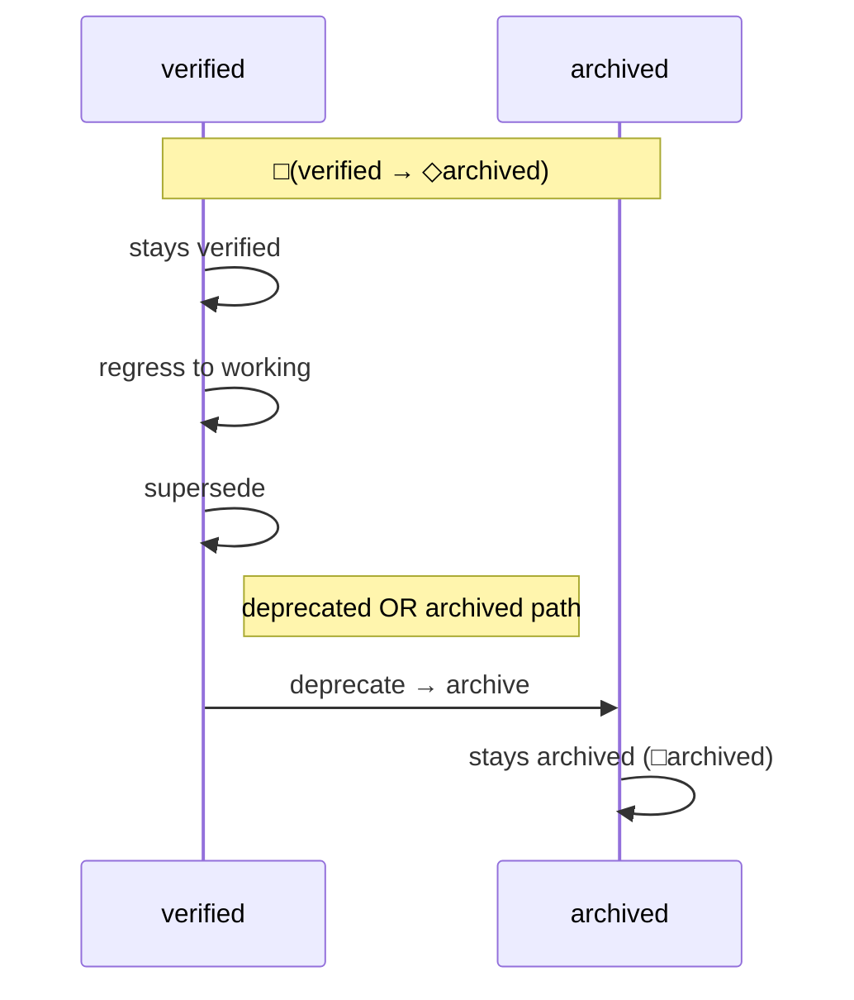

# Theory: Linear-time Temporal Logic

**Rigor:** temporal+

LTL operators over state sequences:

- □P — "always P" (P holds in every state of every run)
- ◇P — "eventually P" (P holds in some future state)
- P ~> Q — "P leads to Q" (whenever P holds, Q eventually holds)

## math-coding instance

math-coding declares two safety and three liveness properties
over packet lifecycle, authoritative in
[[math/theory-ltl-as-packet/refinement.md|the LTL refinement]]. The convention
treats them as run-time obligations of the verifier Phase B
extended in Phase D with semantic checks.

## Diagram (Mermaid: lifecycle trajectory)

