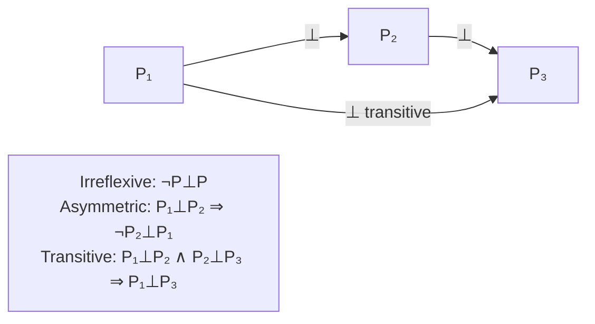

# Theory: Deprecation (partial order)

**Rigor:** property

Supersession is a binary relation ⊥ between packets. It is a
*strict partial order* when it satisfies:

- Irreflexive   ¬(P ⊥ P)
- Asymmetric    P₁ ⊥ P₂ ⇒ ¬(P₂ ⊥ P₁)
- Transitive    P₁ ⊥ P₂ ∧ P₂ ⊥ P₃ ⇒ P₁ ⊥ P₃

A DAG of packets (verified by `core/verify.sh:depends_on`)
extends naturally with supersession edges.

## math-coding instance

In math-coding, supersession is declared in `packet.yaml`
under a `supersession:` block, present only when
`lifecycle: superseded`. Convention recognises three
semantics of ⊥: renamed, replaced, removed — see
[[math/theory-deprecation-as-packet/refinement.md#operations|the ⊥ semantics table]].

## Diagram (Mermaid: partial order properties)

